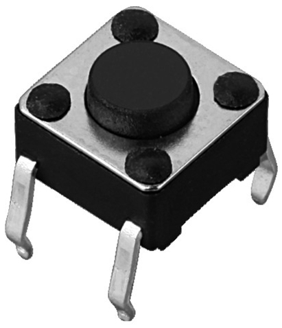
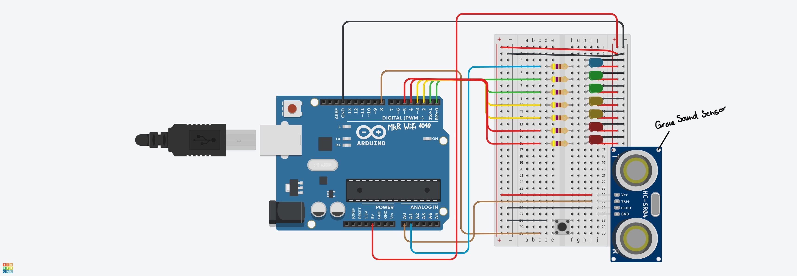
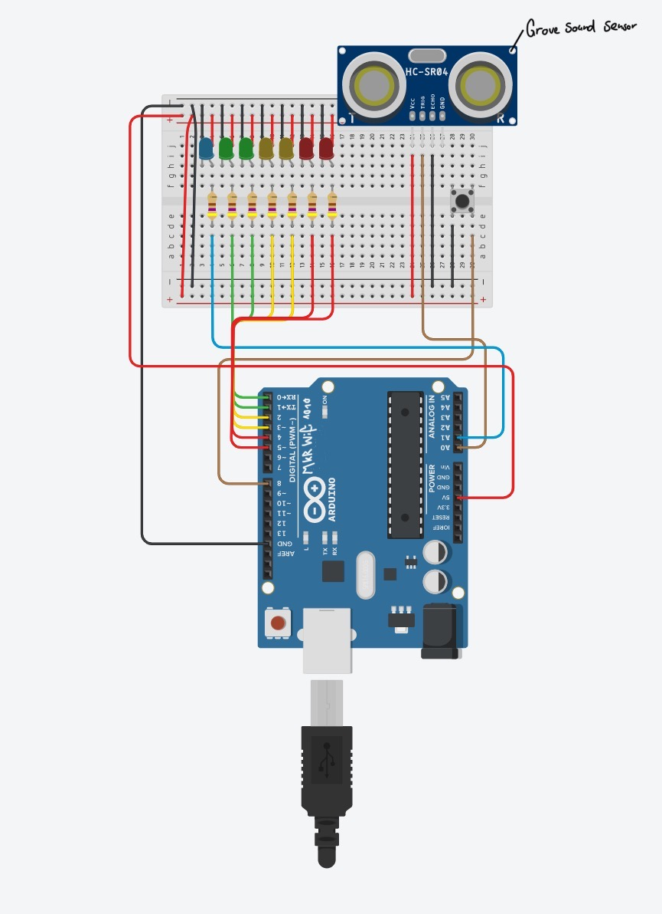
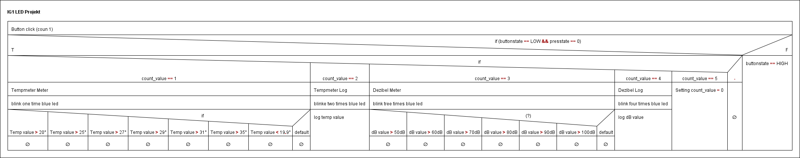
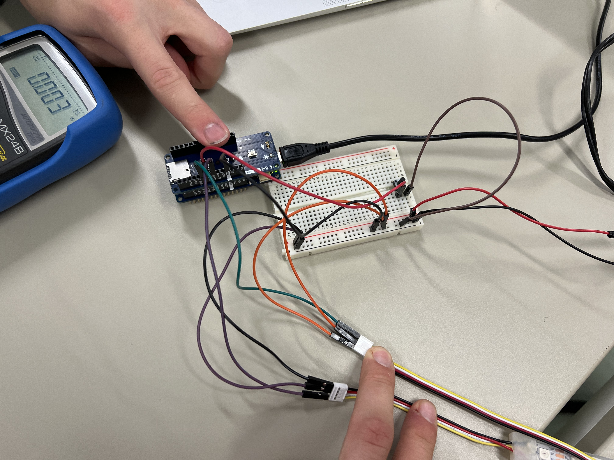
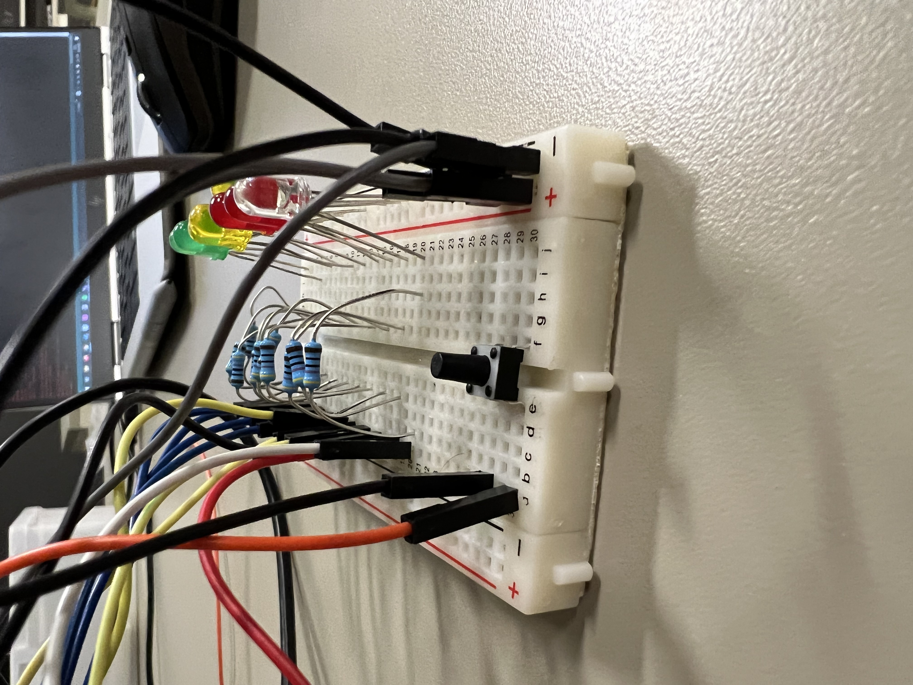
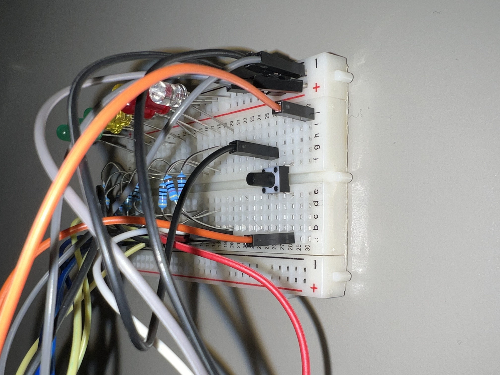

# IG1_LEDProjekt

Dies ist das Projekt von Herr Schmidli und Herr Götzer. In der GITHUB Ablage finden sie das ganze Projekt und alle dazugehörigen Daten. Die ganze Ablage ist Dokumentiert und beschrieben.

# Inhaltsverzeichnis
- [IG1_LEDProjekt](#ig1_ledprojekt)
- [Inhaltsverzeichnis](#inhaltsverzeichnis)
- [Projekt-Auftrag](#projekt-auftrag)
  - [Lernziele](#lernziele)
  - [Projekt Aufgabe](#projekt-aufgabe)
  - [Abgabe der Projektarbeit](#abgabe-der-projektarbeit)
- [Projekt Beschrieb](#projekt-beschrieb)
- [Analyse](#analyse)
  - [Funktionale Anforderungen](#funktionale-anforderungen)
  - [Nicht-funktionale Anforderungen](#nicht-funktionale-anforderungen)
  - [Signalbeschrieb](#signalbeschrieb)
  - [Blockschaltbild](#blockschaltbild)
- [Design](#design)
  - [Detailschema](#detailschema)
  - [Werte-Zuweisungs-Tabelle](#werte-zuweisungs-tabelle)
  - [Programm-Ablauf](#programm-ablauf)
  - [Definierte-Testcases](#definierte-testcases)
- [Implementierung](#implementierung)
  - [Realisierung](#realisierung)
  - [Source-Code](#source-code)
- [Testing](#testing)
  - [Durchführung-Testcases](#durchführung-testcases)
- [Road to Goal](#road-to-goal)
  - [Geschichte](#geschichte)
  - [Flashbacks](#flashbacks)
- [Reflexion (Problemstellungen)](#reflexion-problemstellungen)
- [Fazit](#fazit)

---

# Projekt-Auftrag
Der Projekt Auftrag kann grundsätzlich vom Dokument [ITSE21a_IG1_Projektauftrag_Arduino_210908.pdf](https://github.com/ask-yo-girl-about-me/IG1_LEDProjekt/blob/main/01_Allgemein/01_Projektinfos/ITSE21a_IG1_Projektauftrag_Arduino_210908.pdf) entnommen werden. 

Diese Infos wurde aus dem vorhin erwähnten PDF kopiert!

## Lernziele 
- Eine eigene Problemstellung in ein lauffähiges Computer Programm umsetzen können
- Programm-Ablauf der Lösung in geeigneter Form abbilden
- Umrechnung von Signalen in einem Programm richtig umsetzen können
- Einfache Programmbefehle sinnvoll und richtig anwenden können
- Sensoren und Aktoren in einem Microcontroller definieren und in ein Programmablauf einbinden können
- Testcases schreiben und anhand der Testcases die Steuerung überprüfen

## Projekt Aufgabe
In diesem Projekt soll eine einfache Aufgabenstellung mit einem Microcontroller umgesetzt werden. Die Aufgabenstellung kann selber definiert werden. Die Aufgabenstellung soll folgende minimale Anforderungen erfüllen:

- Das System muss digitale und analoge Ein- und Ausgänge verwenden
- Das System soll eine praxisnahe Aufgabenstellung lösen
- Die Realisierung der Aufgabenstellung wird selbständig umgesetzt und kann erklärt werden
- Die Implementierung soll mit einem ARDUINO Microcontroller (Z.B. MKR1010 oder ähnlich),umgesetzt werden

## Abgabe der Projektarbeit
|Was|Beschreibung|
|--------|--------|
|    Dokumentation    |    Vollständige PDF-Dokumentation    |
|    Source Code    |    Source Code und Libraries (Arduino Sketch) als ZIP File    |
|    Abgabe Format    |    Das gesamte Projekt wird als ZIP File abgegeben    |
|    Namenskonvention    |    Nachname01_Nachname02_ITSE21a_Projektauftrag.ZIP    |
|    Abgabeort    |    Teams…\Kursmaterialien\04_Abgaben    |
|    Abgabe Dokumentation    |    23.01.22    |
|    Schluss-Präsentation    |    27.01.22 oder 03.02.22    |

---

# Projekt Beschrieb
Der Projekt Beschrieb, basiert auf dem Projekt Antrag. Der Projektbeschrieb wurde durch Herr Schmidli und Herr Götzer erstellt. Dieser wurde durch Herr Jäger abgesegnet und somit per PDF festgehalten. 

Das Original ist hier zu finden: [Goetzer_Schmidli_ITSE21a_IG1_Projektantrag_V2.pdf](https://github.com/ask-yo-girl-about-me/IG1_LEDProjekt/blob/main/02_Documents/01_Projektbezogenes/Goetzer_Schmidli_ITSE21a_IG1_Projektantrag_V2.pdf)

Am 04.11.2021 wurde eine zweite Version des Projekt Beschriebs erstellt. Dies wurde aus dem Grund gemacht, da wir Probleme hatten mit der LED Hardware. Somit haben wir den Projektantrag minim angepasst um das Problem mit den LED Stripes zu umgehen.

Hier den definierten Projekt Beschrieb vom [Projektantrag V2](https://github.com/ask-yo-girl-about-me/IG1_LEDProjekt/blob/main/02_Documents/01_Projektbezogenes/Goetzer_Schmidli_ITSE21a_IG1_Projektantrag_V2.pdf):

In unserem Projekt handelt es sich um zwei integrierte Programme mit LEDs. Per Druck-Knopf wechseln wir durch die verschiedenen Programme durch. Programm eins handelt sich um die aktuelle Temperatur, welche durch Ändern der Farbe auf den LEDs angezeigt wird. Programm zwei handelt sich um einen dB Meter. Das Programm startet mit deaktivierten LEDs. Sobald Ton erkannt wird, werden die LEDs gemäss dB von unten nach oben aktiviert. Dies wird zusätzlich noch mit Farbe (Rote, grüne und Gelbe LEDs) gekennzeichnet.
Der Programmwechsel durch den Knopf wird mittels Blinkens von grünen LEDs angezeigt. Programm eins blinkt einmal für eine definierte Zeit. Programm zwei blinkt zwei Mal für eine definierte Zeit.

Optional wenn noch Zeit zur Verfügung ist:
- Messwerte auf eine SD-Karte Protokollieren

Erforderliche Hardware für Projekt:
- MKR Wifi 1010
- MKR ENV Shield (Für Thermometer)
- Mikrophon *Grove Sound Sensor v1.6* (Für dB Messer)
- SD-Karte
- 2 Grüne LED
- 2 Gelbe LED
- 2 Rote LED
- Druck-Knopf

---

# Analyse
Hier bei der Analyse werden alle nötigen Infos definiert aufgezeigt, welche man für die Realisation braucht.

## Funktionale Anforderungen

**Lernziel 1_Analyse 1**

>- *"Es gibt eine vollständige Liste mit den funktionalen Anforderungen und diese sind umfassend beschrieben (SMART)"*

Die Funktionalen Anforderungen wurden anhand von den Testcases definiert.

**1. dB Meter**
   - Beim dB Meter werden nur die grünen, gelben und roten LEDs genutzt. 
   - Das erste grünen LED leuchtet wenn der dB Wert 50db oder mehr erreicht.
   - Das zweite grüne LED leuchtet wenn der dB Wert 60db oder mehr erreicht. 
   - Das erste gelben LED leuchtet wenn der dB Wert 70db oder mehr erreicht.
   - Das zweite gelbe LED leuchtet wenn der dB Wert 80db oder mehr erreicht.
   - Das erste rote LED leuchtet wenn der dB Wert 90db oder mehr erreicht.
   - Das zweite rote LED leuchtet wenn der dB Wert 100db oder mehhr erreicht.

**2. Temp Meter**
   - Beim Temp Meter werden die grünen, gelben, roten und blauen LEDs gebraucht
   - Das erste grünen LED leuchtet wenn der Temp Wert 20° oder mehr erreicht.
   - Das zweite grüne LED leuchtet wenn der dB Wert 25° oder mehr erreicht. 
   - Das erste gelben LED leuchtet wenn der dB Wert 27° oder mehr erreicht.
   - Das zweite gelbe LED leuchtet wenn der dB Wert 29° oder mehr erreicht.
   - Das erste rote LED leuchtet wenn der dB Wert 31° oder mehr erreicht.
   - Das zweite rote LED leuchtet wenn der dB Wert 35° oder mehhr erreicht.
   - Das blaue LED leuchtet wenn der dB Wert unter 19.99° oder weniger fällt.

**3. Sonstiges**
   - Die dB Daten werden per Mikrofon auf eine SD Karte geloggt. Der Wert wir in ein eigenes csv File gespeichert.
   - Die Temperatur Daten werden per Mikrofon auf eine SD Karte geloggt. Der Wert wir in ein eigenes csv File gespeichert.
   - Durch einen Knopfdruckt kann man von einem Programm in das andere gehen. Es fängt mit dem Tempmeter an, dann werden die Temp daten geloggt, als drittes kommt der db Meter und als guter letzt werden die db Daten geloggt.

## Nicht-funktionale Anforderungen

**Lernziel 1_Analyse 1.1**

>- *"Es gibt eine Liste mit den nicht-funktionalen Anforderungen"*

Die Nicht-funktionalen Anforderungen wurden anhand von den Testcases definiert.

**1. SD Karte entfernen**
   Wenn das Programm gestartet wird und keine SD Karte vorhanden ist, beendet der Arduino das Programm und gibt im Serial Monitor aus, dass keine SD Karte gefunden wurde.

**2. Kein Shield aktiv**
   Wenn das Programm ohne ENV Shield gestartet wird, gibt dies der Serial Monitor aus.

**3. Mikrofon entfernen**
   Wenn währen dem Programm das Mikrofon entfernt wird, werden keien dB Werte mehr ausgegeben.

**4. Knopfdruck im Programm 4**
   Wenn man im letzten Programm ist (dB Werte Loggen) und dann den Knopfdruckt, setzt er den Count wieder zurück.
  
## Signalbeschrieb

**Lernziel 1_Analyse 2**

>- *Sämtiche Signale an den Ein- und Ausgängen sind vollständig beschrieben: Signalart, Wertebereich, Umwandlungen*

**1. Schalter am Eingang**

Um zwischen den Programm zu wechseln, wird der folgende Button eingesetzt: 

|Parameter|Beschreibung|
|-----|------|
|Signalart| Gleichspannung |
|Wertebereich| 0 V oder 3.3 V |
|Umwandlung| 0 V entspricht keiner Funktion und 3.3 V entspricht change case |

 
**2. Mikrofon am Eingang (Grove Sound Sensor v1.6)**

Um zu detektieren, wie laut es ist, wird der folgende Sensor eingesetzt: 

|Parameter|Beschreibung|
|-----|------|
|Signalart| Wechselspannung (das Mik wandelt Schalldruck in Wechselspannung um) |
|Wertebereich| zwischen 0 V und 3.3 V sind alle Werte möglich |
|Umwandlung| z.B. 70 dB SPL entsprechen 1.2 V AC und bedeutet im Programm, dass die grüne LED leuchtet |

**Spezifikationen Mikrofon**

|Item|Value|
|-----|------|
|Operating Voltage Range| 3.3/5 V |
|Operating Current(Vcc=5V)|4~5 mA|
|Voltage Gain(V=6V, f=1kHz)|26 dB|
|Microphone sensitivity(1kHz)|52-48 dB|
|Microphone Impedance|2.2k Ohm|
|Microphone Frequency|16-20 kHz|
|Microphone S/N Radio|54 dB|

**3. LED am Ausgang**

Um zu anzuzeigen, wie laut oder warm es ist, wirden folgende LEDs eingesetzt: 

|Parameter|Beschreibung|
|-----|------|
|Signalart| Gleichspannung |
|Wertebereich| zwischen 0 und 3.3 V |
|Umwandlung| 0 V LED deaktiviert 3.3 V LED aktiv |

**4. ENV Shield**

Um zu detektieren, wie die Temperatur ist, wird der folgende Sensor eingesetzt: 

|Parameter|Beschreibung|
|-----|------|
|ICS| LPS22HB / TEMT6000 |
|Input Voltage| 3.3V  |
| Operating Voltage | 3.3V |
| Ranges | Pressure: 260 to 1260 hPa rH sensitivity: 0.004% rH/LSB Humidity accuracy: ± 35% rH, 20 to +80% rH UVA, UVB and UVBI measurment0 0 to 650 Lux |
| Communications | I2C/Analog |
| Length | 61mm |
| Width | 25mm |
| Weight | 32g |

	

**5. SD Karte**

Um die Daten zu loggen, wird folgendes SD Modul auf dem ENV Shield eingesetzt: 

So sieht das Schemabild von der SD Karte aus welche auf dem ENV Shield ist. 

Hier ist der Link zum ganzen Schemabild vom ENV Shield: [Arduino ENV Shield Shematics](https://content.arduino.cc/assets/MKRENVShieldV4.0_sch.pdf?_gl=1*1issfvw*_ga*ODA3NzI5MTkxLjE2MzM5NTUwMTU.*_ga_NEXN8H46L5*MTY0MjM0ODU4MC4xOS4xLjE2NDIzNDg1ODAuMA..)

Hier ist Grafisch aufgezeigt, wie eine SD Karte auf dem ENV Shield arbeitet. 

- SCLK = Der Serial Clock auch SCLK, wird vom Master zur Synchronisation ausgegeben [^1]
- MOSI = MOSI—Master Output Slave Input—transmits data vom Master zum Slave [^1]
- MISO = MISO—Master Input Slave Output—transmits data vom Slave zum Master [^1]
- SS = Slave Select falls mehrer Chips vorhanden sind (bei uns nicht der Fall)

## Blockschaltbild

**Lernziel 1_Analyse 3**

>- *"Es liegt ein vollständiges Blockschaltbild (Übersichtsschema) vor"*
>- *"Saubere und übersichtliche Darstellung: keine oder wenig Kreuzungen, nur horizontale oder vertikale Linien, Beschriftung sämtlicher Elemente"*

---

# Design

## Detailschema

**Lernziel 2_Design 1**

>- *"Es liegt ein vollständiges Detailschema des Prototypen mit Pingranularität vor, d.h. jeder einzelne Pin ist ersichtlich"*
>- *"Saubere und übersichtliche Darstellung: keine oder wenig Kreuzungen, nur horizontale oder vertikale Linien, Beschriftung sämtlicher Elemente"*

Hier finden sie den Link zur TinkerCAD Seite wo das Blockschaltbild erstellt wurde. Dieses unten noch als Bild aufgezeigt.

[TinkerCAD](https://www.tinkercad.com/things/7osfcFXCBFJ)

**Breit Format**

**Hoch Format**

## Werte-Zuweisungs-Tabelle

**Lernziel 2_Design 2**

>- *"Die Verknüpfungen (Logik) der Ein- und Ausgangssignale sind vollständig beschrieben"*

**1. Grove Sound Sensor v1.6**

|  Input   |   Output   |  Beschreibung |
|--------|--------|--------|
|   PIN A0   |   LED grün Pin 0 ein oder ausschalten   |    Wenn >50db   |
|   PIN A0   |    LED grün Pin 1 ein oder ausschalten   |   Wenn >60db    |
|   PIN A0   |   LED gelb Pin 2 ein oder ausschalten   |   Wenn >70db     |
|   PIN A0   |   LED gelb Pin 3 ein oder ausschalten   |   Wenn >80db     |
|   PIN A0   |   LED rot Pin 4 ein oder ausschalten   |    Wenn >90db    |
|   PIN A0   |   LED rot Pin 5 ein oder ausschalten   |   Wenn >100db     |
|   PIN A0   |   LED blau Pin A1 ein oder ausschalten   |    Bei dB nicht im gebraucht    |

**2. ENV Shield Temperatur**

|  Input   |   Output   |  Beschreibung |
|--------|--------|--------|
|   ENV Shield Temperatur   |   LED grün Pin 0 ein oder ausschalten   |    Wenn >20°   |
|   ENV Shield Temperatur   |   LED grün Pin 1 ein oder ausschalten   |   Wenn >25°    |
|   ENV Shield Temperatur   |   LED gelb Pin 2 ein oder ausschalten   |   Wenn >27°     |
|   ENV Shield Temperatur   |   LED gelb Pin 3 ein oder ausschalten   |   Wenn >29°     |
|   ENV Shield Temperatur   |   LED rot Pin 4 ein oder ausschalten   |    Wenn >31°    |
|   ENV Shield Temperatur   |   LED rot Pin 5 ein oder ausschalten   |   Wenn >35°     |
|   ENV Shield Temperatur   |   LED blau Pin A1 ein oder ausschalten   |    Wenn <19.9°    |

**Button**

|  Input   |   Output   |  Beschreibung |
|--------|--------|--------|
|   PIN 8 Gedrückt ja/nein   |   Count value steigt und nächstes Programm startet   | Es zählz immer einen dazu, bis 5 dann resetet er den count   |

## Programm-Ablauf

**Lernziel 2_Design 3**

>- *"Der Programmablauf ist mit einer geeigneten Darstellungsmethode (Struktogramm, Flussdiagramm, Statemachine, …) vollständig beschrieben*
>- *"Der Programmablauf ist sauber gezeichnet""*

Die Datenablage für den Programm-Ablaufen finden Sie hier: [Ablage Programm-Ablauf](https://github.com/ask-yo-girl-about-me/IG1_LEDProjekt/tree/main/03_Projekt/01_Structorizer)

## Definierte-Testcases

**Lernziel 2_Design 4**

>- *"Es liegt eine Liste mit sämtlichen Testcases, basierend auf den funktionalen und nicht-funktionalen Anforderungen, vor"*

Testgruppen

|  Nr.  |  Thema  |  Was?  |
|--------|--------|--------|
|  TG-10  |  Dezibel Meter  |  Der Dezibel Meter wird auf seine funktionalitäten gemäss Funktionalen und nicht-funktionalen Anforderungen überprüft  |
|  TG-20  |  Temperatur Meter  |  Der Temperatur Meter wird auf seine funktionalitäten gemäss Funktionalen und nicht-funktionalen Anforderungen überprüft  |
|  TG-30  |  Change Case  |  Der Case Change wird auf seine funktionalitäten gemäss Funktionalen und nicht-funktionalen Anforderungen überprüft  |
|  TG-40  |  SD Loggin  |  Das loggen auf die SD Karte wird auf seine funktionalitäten gemäss Funktionalen und nicht-funktionalen Anforderungen überprüft  |

**TG-10**
|  Nr.  |  Was  |  Wie  |  Erwartetes Resultat  |
|--------|--------|--------|--------|
|  10-1  |  Grüne LEDS  | Auf Handy Musik laufen lassen welche zwischen 50db und 60db ist | Es dürfen nur die grünen LEDs leuchten
|  10-2  |  Gelben LEDS  |   Auf Handy Musik laufen lassen welche zwischen 70db und 80db ist | Es müssen die grünen und die gelben LEDs leuchten |
|  10-3  |  Roten LEDS  |  Auf Handy Musik laufen lassen welche zwischen 90db und 100db ist | Die grünen, gelben und roten LEDs müssen aktiv sein |
|  10-4  |  Kein Microfon  |  Microfon entfernen während dem Betrieb  |  Keine LEDs sind aktiv | 

**TG-20**
|  Nr.  |  Was  |  Wie  |  Erwartetes Resultat  |
|--------|--------|--------|--------|
|  20-1  |  Grüne LEDs  |  Temperatur muss zwischen 20° und 25° sein | Nur die grüne LEDs dürfen aktiv sein|
|  20-2  |  Gelbe LEDs  |  Temperatur muss zwischen 27° und 29° sein | Die grüne und gelben LEDs müssen aktiv sein |
|  20-3  |  Roten LEDs  |  Temperatur muss zwischen 31° und 35° sein  | Die grüne. gelben und roten LEDs müssen aktiv sein |
|  20-4  |  Blaue LEDs  |  Temperatur muss auf 19.99 oder weniger reguliert werden | Die blaue LED muss aktiv sein |

**TG-30**
|  Nr.  |  Was  |  Wie  |  Erwartetes Resultat  |
|--------|--------|--------|--------|
|  30-1  |  In das erste Programm wechseln  | Nach dem Programm Start Knopf ein Mal drücken  | 1 Case läuft durch (Tempmeter) |
|  30-2  | In das zweite Programm wechseln   | Wenn man in Case 1 ist Knopf nochmals drücken | 2 Case läuft durch (dB meter)
|  30-3  |  3 Knopfdruck  | Knopf im Case 2 nochmals drücken  |  Keine LEDs aktiv  |

**TG-40**
|  Nr.  |  Was  |  Wie  |  Erwartetes Resultat  |
|--------|--------|--------|--------|
|  40-1  |  Dezibel Daten werden geloggt  |  Das ganze per SD Karte und dem Microfon. SD Karte nach durchlaufen des Programms entfernen und an einen PC/Laptop anschliesen  | Ein CSV File mit den Daten enthalten. Dezibel-Value. |
|  40-2  |  Temperatur Daten werden geloggt  | Das ganze per SD Karte und dem ENV Shield. SD Karte nach durchlaufen des Programms entfernen und an einen PC/Laptopn anschliesen  | Ein CSV File mit den Temperatur Date enthalte.  |
|  40-3  |  SD Karte entfernen  | SD Karte währent dem laufen des Programms entfernen  | Daten sind auf in CSV enthalten |
|  40-4  |  Keine SD Karte  | Das Programm ohne SD Karte starten  | Meldung im Serial Monitor, dass keien SD Karte vorhanden ist. |

---

# Implementierung

## Realisierung

---
**Lernziel 3_Implementierung 1**

>- *Schwirigkeitsgrad*
> *0: einfach, von Vorlage kopiert*
> *1: einfach, leicht modifiziert und erweitert*
> *2: anspruchsvoll*
> *3: komplex*
>- *Sämtliche funktionalen und nicht-funktionalen Anforderungen werden erfüllt und können demonstriert werden*
>- *Zweckmässiger, robuster Aufbau*

Die Realisierung wurde gemäss anforderungen welche durch den Lehrer festgelet wurden und dem Projekt beschrieb welcher durch Herr Schmidli und Herr Götzer definiert wurden durchgeführt.

---

## Source-Code

**Lernziel 3_Implementierung 2-3**

>- *Schwirigkeitsgrad*
> *0: einfach, kopiert von einem HelloWord Beispiel*
> *1: einfach, leicht modifiziert und erweitert*
> *2: mittelschwer (Funktionen, Variablen, Iterationen, Verzweigungen, …)*
> *3: anspruchsvoll (Register, Interrupts, Umrechnungen, ...)*
> *4: komplex (json, State Machine, Arrays, ...)*
>- *Der eigene Code kann Zeile für Zeile erklärt werden*
>- *Der Source Code ist nachvollziehbar kommentiertVerwendete Quellen sind deklariert*

Der Sketch findet man unter diesem Link: [Arduino Sketch](../IG1_LEDProjekt/03_Projekt/03_Arduino_Sketches/01_LEDProjekt/LED_Projekt/LED_Projekt.ino)

Hier ist der Code noch als Text aufgeführt:

      #include <Arduino_MKRENV.h>
      #include <SPI.h>
      #include <SD.h>
      #define MIC A0

      // Button Pin definieren
      const int button = 8;     

      // Chip Auswahl für PIN 4
      const int SD_CS_PIN = 4;  

      // Variabel Definitionen //
      // CountButton
      int buttonState = 0;         
      int count_value = 0;
      int prestate = 0;
      int ledblink = 1;
      // Temp Meter
      float temperature = 0;
      // DB Meter
      int adc;
      int dB, PdB; 

      // File Objekt für Log auf SD Karte
      File dataFile_temp;
      File dataFile_dB;

      void setup() {
         // Inizialisieren des Buttons PIN als Input
         pinMode(button, INPUT_PULLUP);
         // Inizialisieren die LED PINs als Output      
         pinMode(0, OUTPUT);
         pinMode(1, OUTPUT);
         pinMode(2, OUTPUT);
         pinMode(3, OUTPUT);
         pinMode(5, OUTPUT);
         pinMode(6, OUTPUT);
         pinMode(A1, OUTPUT);
      
         Serial.begin(9600);
         while (!Serial);
         
         // init das ENV Shield
         if (!ENV.begin()) {
            // Wenn das ENV Shield nicht inizialisiert werden kann, kommt diese Meldung
            Serial.println("Failed to initialize MKR ENV shield!");
            while (1);
         }

         // init SPI
         SPI.begin();
         delay(100);

         // init die SD card
         if(!SD.begin(SD_CS_PIN)) {
            // Wenn die SD Karte nicht inizialisiert werden kann, kommt diese Meldung
            Serial.println("Failed to initialize SD card!");
            while (1);
         }

         // init das logfile
         // Log File für die Temperatur
         dataFile_temp = SD.open("log-0001.csv", FILE_WRITE);
         delay(1000);
         // Log File für den dB
         dataFile_dB = SD.open("log-0002.csv", FILE_WRITE);

         // init the CSV file with headers
         dataFile_temp.println("temperature");
         dataFile_dB.println("dB");

         // close the file
         dataFile_temp.close();
         delay(100);
         dataFile_dB.close();
      }

      void loop() {
         // pushbutto Wert auslesen
         buttonState = digitalRead(button);

         // Kontrollieren ob der pushbutton gedrückt ist. Wenn ja, dann ist der buttonState HIGH
         if (buttonState == LOW && prestate == 0) {
            count_value++;
            Serial.print(count_value);
            delay(100);
            prestate = 1;
         }else if(buttonState == HIGH){
            prestate = 0;
         }

         // Programm Temperatur Meter //
         if (count_value == 1){
            // Erstes Programm wird hier mit ein Mal blinken der Blauen LED angezeigt
            if (ledblink == 1){
                  digitalWrite(A1, HIGH);
                  delay(1000);
                  digitalWrite(A1, LOW);
                  ledblink = 2;
            }

            // Lesen der Temperatur Werte
            float temperature = ENV.readTemperature();

            // Gibt die Temperatur Werte im Serial Monitor aus
            Serial.print("Temp Meter = ");
            Serial.print(temperature);
            
            // Hier passiert der ganze Zauber, welche LED aktiv sein muss oder eben nicht
            Serial.println();
            // Blaue LED HIGH wenn unter 19.99° ansonsten LOW
            if (temperature<19.99) {digitalWrite(A1, HIGH);} else {digitalWrite(A1, LOW);}
            // 1 Grüne LED HIGH wenn über 20° ansonsten LOW
            if (temperature>20.00) {digitalWrite(0, HIGH);} else {digitalWrite(0, LOW);}
            // 2 Grüne LED HIGH wenn über 25° ansonsten LOW
            if (temperature>25.00) {digitalWrite(1, HIGH);} else {digitalWrite(1, LOW);}
            // 1 Gelbe LED HIGH wenn über 27° ansonsten LOW
            if (temperature>27.00) {digitalWrite(2, HIGH);} else {digitalWrite(2, LOW);}
            // 2 Gelbe LED HIGH wenn über 29° ansonsten LOW
            if (temperature>29.00) {digitalWrite(3, HIGH);} else {digitalWrite(3, LOW);}
            // 1 Rote LED HIGH wenn über 31° ansonsten LOW
            if (temperature>31.00) {digitalWrite(5, HIGH);} else {digitalWrite(5, LOW);}
            // 2 Rote LED HIGH wenn über 35° ansonsten LOW
            if (temperature>35.00) {digitalWrite(6, HIGH);} else {digitalWrite(6, LOW);}
            buttonState;
         }

         // Programm Log Temperatur //
         if (count_value == 2){
            if (ledblink == 2){
                  // Zweites Programm wird hier mit zwei Mal blinken der Blauen LED angezeigt
                  digitalWrite(A1, HIGH);
                  delay(1000);
                  digitalWrite(A1, LOW);
                  delay(1000);
                  digitalWrite(A1, HIGH);
                  delay(1000);
                  digitalWrite(A1, LOW);
                  ledblink = 3;
            }
            // init das logfile
            dataFile_temp = SD.open("log-0001.csv", FILE_WRITE);
            delay(1000);
            
            // Lesen der Temperatur Werte
            float temperature = ENV.readTemperature();
            
            // Gibt die Temperatur Werte im Serial Monitor aus
            Serial.print("Temp Log = ");
            Serial.println(temperature);
            
            // Gibt die Temperatur Werte in das logfile
            dataFile_temp.print(temperature);
            // Schliesst das Logfile
            dataFile_temp.close();
            // Wartet eine Sekunde bis zur nächster Ausgabe
            delay(1000);
            buttonState;
         }

         // Programm Dezibel Meter //
         if (count_value == 3){
            if (ledblink == 3){
                  // Drittes Programm wird hier mit drei Mal blinken der Blauen LED angezeigt
                  digitalWrite(A1, HIGH);
                  delay(1000);
                  digitalWrite(A1, LOW);
                  delay(1000);
                  digitalWrite(A1, HIGH);
                  delay(1000);
                  digitalWrite(A1, LOW);
                  delay(1000);
                  digitalWrite(A1, HIGH);
                  delay(1000);
                  digitalWrite(A1, LOW);
                  delay(1000);
                  ledblink = 4;
            }   

            // Lesen der Dezibel Werte
            //ADC Werte lesen vom Verstärker
            adc= analogRead(MIC); 
            // Konvertieren der ADC Werte in dB anhand von Regression Werten
            dB = (adc+83.2073) / 11.003;
            // Gibt im Serial Monitor die db Werte aus
            Serial.print("dB Meter = ");
            Serial.println(dB);

            // Hier passiert der ganze Zauber, welche LED aktiv sein muss oder eben nicht
            Serial.println();
            // 1 Grüne LED HIGH wenn über 50dB ansonsten LOW
            if (dB>50) {digitalWrite(0, HIGH);} else {digitalWrite(0, LOW);}
            // 2 Grüne LED HIGH wenn über 60dB ansonsten LOW
            if (dB>60) {digitalWrite(1, HIGH);} else {digitalWrite(1, LOW);}
            // 1 Gelbe LED HIGH wenn über 70dB ansonsten LOW
            if (dB>70) {digitalWrite(2, HIGH);} else {digitalWrite(2, LOW);}
            // 2 Gelbe LED HIGH wenn über 80dB ansonsten LOW
            if (dB>80) {digitalWrite(3, HIGH);} else {digitalWrite(3, LOW);}
            // 1 Rote LED HIGH wenn über 90dB ansonsten LOW
            if (dB>90) {digitalWrite(5, HIGH);} else {digitalWrite(5, LOW);}
            // 2 Rote LED HIGH wenn über 100dB ansonsten LOW
            if (dB>100) {digitalWrite(6, HIGH);} else {digitalWrite(6, LOW);}
            buttonState;
         }
      
         // Programm Log Dezibel //
         if (count_value == 4){
            if (ledblink == 4){
                  // Viertes Programm wird hier mit vier Mal blinken der Blauen LED angezeigt
                  digitalWrite(A1, HIGH);
                  delay(1000);
                  digitalWrite(A1, LOW);
                  delay(1000);
                  digitalWrite(A1, HIGH);
                  delay(1000);
                  digitalWrite(A1, LOW);
                  delay(1000);
                  digitalWrite(A1, HIGH);
                  delay(1000);
                  digitalWrite(A1, LOW);
                  delay(1000);
                  digitalWrite(A1, HIGH);
                  delay(1000);
                  digitalWrite(A1, LOW);
                  delay(1000);
                  ledblink = 5;
            }
            // init das logfile
            dataFile_dB = SD.open("log-0002.csv", FILE_WRITE);
            delay(1000);
            
            // Lesen der Dezibel Werte
            //ADC Werte lesen vom Verstärker
            adc= analogRead(MIC); 
            // Konvertieren der ADC Werte in dB anhand von Regression Werten
            dB = (adc+83.2073) / 11.003;
            // Gibt im Serial Monitor die db Werte aus
            Serial.print("dB Log = ");
            Serial.println(dB);

            // Gibt die Temperatur Werte in das logfile
            dataFile_dB.print(dB);
            // Schliess das logfile
            dataFile_dB.close();
            // Wartet eine Sekunde bis zur nächster Ausgabe
            delay(1000);
            
            buttonState;
         }
         
         // Programm 5 bei dem nichts mehr passiert und der Count wieder auf 0 gesezt wird, somit kann man das ganze wieder von Programm eins nutzen
         if (count_value == 5){
            count_value =0;
            buttonState;
         }
      }

---

# Testing

**Lernziel 4_Testing 1-2**

>- *Es liegt eine Liste mit Testcases vor, welche auf den funktionalen und nicht-funktionalen Anforderungen basiert*
>- *Die Testcases sind durchgeführt und die Resultate liegen vor*
>- *Es liegt eine Tabelle mit folgenden Spalten vor: Nummer, Beschreibung, erwartete Reaktion, Ergebnis, Status*
>- *Sämtliche Testcases sind in einer Tabelle dokumentiert*

## Durchführung-Testcases

**Testgruppen**

|  Nr.  |  Thema  |  Was?  |  Resultat  |
|--------|--------|--------|--------|
|  TG-10  |  Dezibel Meter  |  Der Dezibel Meter wird auf seine funktionalitäten gemäss Funktionalen und nicht-funktionalen Anforderungen überprüft  |  |
|  TG-20  |  Temperatur Meter  |  Der Temperatur Meter wird auf seine funktionalitäten gemäss Funktionalen und nicht-funktionalen Anforderungen überprüft  |   |
|  TG-30  |  Change Case  |  Der Case Change wird auf seine funktionalitäten gemäss Funktionalen und nicht-funktionalen Anforderungen überprüft  |    |
|  TG-40  |  SD Loggin  |  Das loggen auf die SD Karte wird auf seine funktionalitäten gemäss Funktionalen und nicht-funktionalen Anforderungen überprüft  |   |

**TG-10**
|  Nr.  |  Was  |  Wie  |  Erwartetes Resultat  | Resultat |
|--------|--------|--------|--------|-------|
|  10-1  |  Grüne LEDS  | Auf Handy Musik laufen lassen welche zwischen 50db und 60db ist | Es dürfen nur die grünen LEDs leuchten
|  10-2  |  Gelben LEDS  |   Auf Handy Musik laufen lassen welche zwischen 70db und 80db ist | Es müssen die grünen und die gelben LEDs leuchten |
|  10-3  |  Roten LEDS  |  Auf Handy Musik laufen lassen welche zwischen 90db und 100db ist | Die grünen, gelben und roten LEDs müssen aktiv sein |
|  10-4  |  Kein Microfon  |  Microfon entfernen während dem Betrieb  |  Keine LEDs sind aktiv | 

**TG-20**
|  Nr.  |  Was  |  Wie  |  Erwartetes Resultat  | Resultat |
|--------|--------|--------|--------|--------|
|  20-1  |  Grüne LEDs  |  Temperatur muss zwischen 20° und 25° sein | Nur die grüne LEDs dürfen aktiv sein|
|  20-2  |  Gelbe LEDs  |  Temperatur muss zwischen 27° und 29° sein | Die grüne und gelben LEDs müssen aktiv sein |
|  20-3  |  Roten LEDs  |  Temperatur muss zwischen 31° und 35° sein  | Die grüne. gelben und roten LEDs müssen aktiv sein |
|  20-4  |  Blaue LEDs  |  Temperatur muss auf 19.99 oder weniger reguliert werden | Die blaue LED muss aktiv sein |

**TG-30**
|  Nr.  |  Was  |  Wie  |  Erwartetes Resultat  | Resultat |
|--------|--------|--------|--------|--------|
|  30-1  |  In das erste Programm wechseln  | Nach dem Programm Start Knopf ein Mal drücken  | 1 Case läuft durch (Tempmeter) |
|  30-2  | In das zweite Programm wechseln   | Wenn man in Case 1 ist Knopf nochmals drücken | 2 Case läuft durch (dB meter)
|  30-3  |  3 Knopfdruck  | Knopf im Case 2 nochmals drücken  |  Keine LEDs aktiv  |

**TG-40**
|  Nr.  |  Was  |  Wie  |  Erwartetes Resultat  | Resultat |
|--------|--------|--------|--------|--------|
|  40-1  |  Dezibel Daten werden geloggt  |  Das ganze per SD Karte und dem Microfon. SD Karte nach durchlaufen des Programms entfernen und an einen PC/Laptop anschliesen  | Ein CSV File mit den Daten enthalten. Dezibel-Value. |
|  40-2  |  Temperatur Daten werden geloggt  | Das ganze per SD Karte und dem ENV Shield. SD Karte nach durchlaufen des Programms entfernen und an einen PC/Laptopn anschliesen  | Ein CSV File mit den Temperatur Date enthalte.  |
|  40-3  |  SD Karte entfernen  | SD Karte währent dem laufen des Programms entfernen  | Daten sind auf in CSV enthalten |
|  40-4  |  Keine SD Karte  | Das Programm ohne SD Karte starten  | Meldung im Serial Monitor, dass keien SD Karte vorhanden ist. |

---

# Road to Goal

## Geschichte

Als erstes haben wir mal Ideen gesammelt, was wir als Projekt machen können. Im Internet haben wir gesehen, dass man mit dem Arduino LEDs ansteuern kann mit LED Streifen. Somit haben wir dies als Grundbau genommen und sind mit der Idee gekommn einen mit LED Streifen einen Dezibel und Temperatur Meter zu machen. Leider mussten wir dies dann aber durch gewisse Progleme durch einzelne LEDs wechseln. 

Nach dem wir unser Projekt beschrieb fertig hatten, machten wir uns an das Detail-Schema und das Struktogramm. Somit haben wir im TinkerCAD das Detail-Schema so aufgebaut wie wir uns das vorgestellt haben und es so dann auch einfacher haben in echt aufzubauen. Das Struktogramm haben wir per Structorizer gezeichnet und haben uns so schon mal einen grundbau für das Programm erstellt.

Nun ist das Grundfundament aufgebaut und alles ist bereit für das Programmierne. Somit machten wir uns an die ansteuerung der einzelnen Geräten.

1. Einzelne LED ansteuern [Link](https://github.com/ask-yo-girl-about-me/IG1_LEDProjekt/blob/main/03_Projekt/03_Arduino_Sketches/02_Einzelansteuerungen/LED-Einzeln/LED-Einzeln.ino)
2. LED Testing [Link](https://github.com/ask-yo-girl-about-me/IG1_LEDProjekt/blob/main/03_Projekt/03_Arduino_Sketches/02_Einzelansteuerungen/LED-Testing/LED-Testing.ino)
3. Button funktionalität [Link](https://github.com/ask-yo-girl-about-me/IG1_LEDProjekt/blob/main/03_Projekt/03_Arduino_Sketches/02_Einzelansteuerungen/button/button.ino)
4. Switch Case mit Button [Link](https://github.com/ask-yo-girl-about-me/IG1_LEDProjekt/blob/main/03_Projekt/03_Arduino_Sketches/02_Einzelansteuerungen/switchcase_button/switchcase_button.ino)
5. Dezibel auslesen in Seriel Monitor [Link](https://github.com/ask-yo-girl-about-me/IG1_LEDProjekt/blob/main/03_Projekt/03_Arduino_Sketches/02_Einzelansteuerungen/Measure_DB/Measure_DB.ino)
6. Temperatur auslesen in Seriel Monitor [Link](https://github.com/ask-yo-girl-about-me/IG1_LEDProjekt/blob/main/03_Projekt/03_Arduino_Sketches/02_Einzelansteuerungen/Measure_Temperature/Measure_Temperature.ino) 
7. ENV Shield Infos auf SD Karte schreiben [Link](https://github.com/ask-yo-girl-about-me/IG1_LEDProjekt/blob/main/03_Projekt/03_Arduino_Sketches/02_Einzelansteuerungen/SD_Writer/store_data_in_memory_card_envshield/store_data_in_memory_card_envshield.ino)
8. dB Meter Infos auf SD karte schreiben [Link](https://github.com/ask-yo-girl-about-me/IG1_LEDProjekt/blob/main/03_Projekt/03_Arduino_Sketches/02_Einzelansteuerungen/SD_Writer/db_SD/db_SD.ino)
9. Dezibel Meter [Link](https://github.com/ask-yo-girl-about-me/IG1_LEDProjekt/blob/main/03_Projekt/03_Arduino_Sketches/02_Einzelansteuerungen/LED_DBMeter/LED_DBMeter.ino)
10. Temperatur Meter [Link](https://github.com/ask-yo-girl-about-me/IG1_LEDProjekt/blob/main/03_Projekt/03_Arduino_Sketches/02_Einzelansteuerungen/LED-TempMeter/LED-TempMeter.ino)

Sobald wir alle einzelnen Ansteuerungen hatten, machten wir uns an das Zusammenführen aller Programme, damit diese in einem einzenlnen Programm tangiert.

## Flashbacks

Hier werden einige Flashbacks aufgezeigt, welche eine Wichtige Rolle in dem ganzen Projekt gespielt haben. 
Die anten kann man sogar als Milestones anschauen.

**Flashback 1**

Das erste mal den Arduino auf der Steckerplatine mit den LEDs verbunden. Dies war das erste erfolgserlebniss von uns beiden. Wir natürlich zuerst die LEDs einmal austesten und schauen wie diese funktionieren.

**Flashback 2**

Hier haben wir verzeifelt den LED Streifen mit unserem Dezibel Meter getestet. Leider funktionierte es aber nie so wie wir wollten. Teilweise machte der LED Streifen garnichts und manchmals machte er sehr komische Sachen, welche wir uns nicht erklären konnten.

**Flashback 3**

Der grosse wechsel auf die LEDs. Nach dem wir mit Herr Jäger darum gesprochen haben, dass wir sehr viel Zeit verlieren mit dem LED Streifen, haben wir uns entschlossen das Projekt ein bisschen anzupassen. Wir haben den LED Streifen mit einzelnen LEDs ausgetauscht. Somit können wir die LEDs einzeln ansteuern aber die Hauptidee bleibt gleich. Nach langer Zeit hatte wir mal ein erfolgserlebis, als die einzelnen LEDs geleichtet haben. Dies gab uns nach den vielen misserfolgen, die wir bis hier hin hatten wieder einen kleinen kick für die Motivation.

**Flashback 4**

Wir haben lange mit dem Button gespielt und hatten auch zwei drei kleine hindernisse. Schlussentlich konnten wir entlich die verknüpfung mit der Theorie welche wir hatten zusammenschliessen.
Wir mussten uns effektiv mit einem Pull up / down Schaltung auseinander setzen. Wir haben dies zuerst einfach nach Gefühl angeschlossen, aber haben bemerkt, dass dies nicht korrekt durchlauft. Somit haben wir uns mit Herr Jäger damit auseinander gesetzt und bemerkt, dass wir den den Pull Up / Down entweder in unsere Schaltung einbauen müssen oder dies per Code definieren. Dies war eine Interessante feststellung und sehr lehrreich.

**Flashback 5**

Grösstes erfolgserlebnis. Nach langem zusammenbauen, recherchieren, testen und misserfolgen, funktionierte unser Dezibel Messer. Dies war ein sehr schöner Moment für uns beiden. An diesem Punkt hatte wird wieder ein bischen einen Motivationsschub und wir freuten uns sehr über diesen Erfolg.

Hier ein Video darüber welches direkt nach dem Erfolg aufgenommen wurde.

[Video dB Meter](https://github.com/ask-yo-girl-about-me/IG1_LEDProjekt/blob/main/00_img/Flashbacks/4.MP4)

**Flashback 6**

Programm wechsel zwischen dB und Temp Meter per Knopfdruck funktioniert!!!!!

Nach dem wir alle einzel ansteuerungen erfolgreich erstellt haben, mussten wir diese alle in ein Programm zusammenführen. Leider funktionierte dies am Anfang nicht so wie wir wollten. Gemäss den Problemen die wir hatten, stellten wir fest (oder wir dachten es zumindest), dass unsere Projekt Idee so wie wir es wollten technisch garnicht funktioniert. Nach langem diskutieren, recherchieren und testen, kamen wir auf eine Lösung und unsere Idee war plötzlich technisch möglich.

---

# Reflexion (Problemstellungen)

Nun am ende mit dem Projekt, können wir beide sagen, dass es ein harter weg war bis ans ende. Wir waren beide sehr Motiviert auf das Projekt und auch unsere Idee. Leider mussten wir recht schnell viele Misserfolge erleben betreffend Hardware und auch nicht funktionierenden Programme. Es hat angefangen mit unwissen von der Programmiersprache C++ welche uns mühe machte. Es ging weiter mit dem LED Streifen welche nur Probleme machte und dem ENV Shield welches ebenfalls nicht funktionierte und so weiter.

Ein weiteres Hinderniss war, dass die LED Library welche wir brauchten nur dann funktionierte, wenn wir den Arduino MKR1000 ausgewählt hatte, obwohl wir einen MKR1010 hatten. Nach dem wir dies herausgefunden haben und so unsere Programme weiter getestet hatte, mussten wir feststellen, das der Computer nun unseren Arduino nicht mehr als MKR1010 sieht sonder als MKR1000. Somit mussten wir sogar unser Arduino umstauschen weil alles andere nicht mehr funktioniert hat.

Wir versuchten aber stets die Motivation oben zu behalten um so an das Ziel zu kommen, auch wenn es nicht immer einfach war. Trotzdem haben wir viel gelertn und kamn sehr weit in unserem Projekt. Den grundfundament von unserem Projekt haben wir erreicht und grundsätzlich das Ziel so erreich. An dieser Stelle muss man natürlich auch sagen, dass die Hilfe von Herr Jäger natürlich auch sehr hilfreich war.

Gegen den Schluss mussten wir aber feststellen, dass unsere vorstellungen von einem Programm welches einen Switch Case enthält und eigentlich zwei Programme in einem enthält nicht ganz funktioniert.

Alles in allem war es aber ein Erfolg. Wir sind mit unserer Leistung zufrieden und stolz darauf, was wir alles erarbeitet haben. Wir hatten beide keine Erfahrung mit Programmieren und mussten uns alles selbst beibringen. Dazu muss man auch sagen, dass wir unser Projekt von den Anforderungen bisschen zu hoch gesetzt haben für unser Wissen.

---

# Fazit

>«Wir erklären hiermit, dass wir diese Arbeit selbständig verfasst und keine anderen als die angegebenen Quellen benutzt haben. Alle Stellen, die wörtlich oder sinngemäss aus Quellen entnommen wurden, haben wir als solche gekennzeichnet.»

[^1]: [SPI/SCLK/MOSI/MISO](https://de.wikipedia.org/wiki/Serial_Peripheral_Interface)